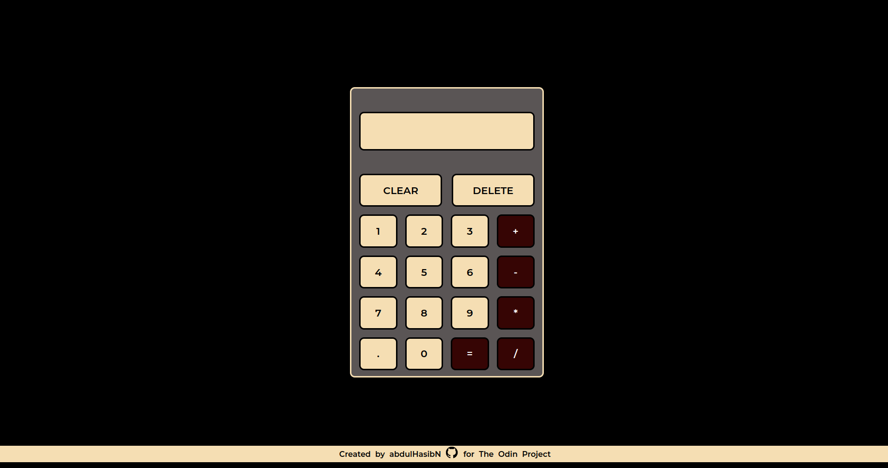
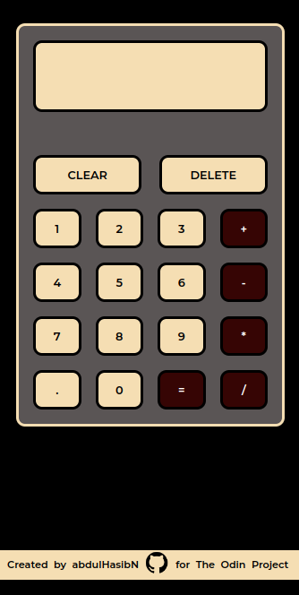

# Calculator

## Table of contents

- [Overview](#overview)
  - [Screenshot](#screenshot)
  - [Links](#links)
  - [My process](#my-process)
  - [Built with](#built-with)
  - [What I learned](#what-i-learned)
  - [Continued development](#continued-development)
  - [Useful resources](#useful-resources)
  - [Author](#author)

## Overview

Started off with reading the project requirements from the odin project assignment page and found it to be overwhelming. Shrugging it off, I focused on the 'breaking into smaller problems' aspect more and started with the smallest problem hand, i.e., creating functions to perform the basic arithmetic calculations. Slowly the project progressed into other problems in the hierarchy, googling the obstacles found along the way.

### Screenshot

Desktop View

Mobile View

### Links

- Live Site URL: (https://abdulhasibn.github.io/Calculator/)

## My process

Instead of starting the project with the UI for the calculator, I started with the functions for performing mathematical calculations. Only then did I proceed to concentrate on the UI of the calculator. After getting more familiar with the grid, as I am not well acquainted with grid as I am with flexbox, I struggled with centering the calculator to the page, as usual. The next first big step is to figure out a way to store the value being entered into the display of the calculator. With few projects already up my sleeve, DOM was not as much of an issue as it was initially. However, selecting the first operand for the arithmetic operation to be performed and the second one was more difficult than I thought it would be.Though I had an idea of using array as a means to achieve what I was intending, I kept on searching for a better method. With that search in vain, I reached out to an experienced programmer, who also resonated with my initial idea. So I proceeded with it. With the big portion of the project already done, it was only clearing up the issues that arose as the project progressed.

After making sure everything works just fine, I moved on to add features to the calculator, like adding keyboard access, as mentioned in the extra credit section of the project assignment.

### Built with

- CSS custom properties
- Grid
- Flexbox
- Js

### What I learned

- Though I have used grid already, I was always afraid of it. But in this project, I learned more and got a better idea of dealing with that.
- Due to some glitch the page got some unexpected errors. So I searched for reversing my previously made commit and learned to do it.
- Learned how to round the numbers to a specified decimal point.
- Studied about keyboard events in Javascript and got familiar with keydown events and using them to manipulate the page.

### Continued development

The more I develope pages and see others talking about them, I get to understand the importance of semantic HTML more. Need to learn it and understand it better.

### Useful resources

- From this website (https://www.jacklmoore.com/notes/rounding-in-javascript/) I learned to round the number to a specified decimal point.
- (https://www.freecodecamp.org/news/javascript-keycode-list-keypress-event-key-codes/) This article from freeCodeCamp and other likes of this helped to grasp the concept of keyboard events better.

## Author

- GitHub - [@abdulhasibn](https://github.com/abdulhasibn)
- Twitter - [@abdulhasibn](https://twitter.com/abdulhasibn99)
